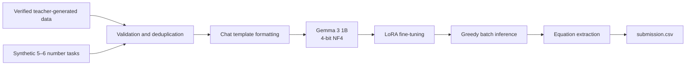

# Fine-Tuning Gemma 3 1B for the Countdown Task

[](https://www.python.org/)
[](https://pytorch.org/)
[](https://huggingface.co/)
[](https://huggingface.co/google/gemma-3-1b-it)
[](https://arxiv.org/abs/2106.09685)

Parameter-efficient fine-tuning of **Gemma 3 1B** for arithmetic reasoning using verified teacher-generated solutions and synthetic Countdown examples.

## Overview

The Countdown task requires a model to construct an arithmetic expression that reaches a target value using every provided number exactly once.

Allowed operations:

```text
+  -  *  /
```

Example:

```text
Numbers: [25, 10, 3, 2]
Target: 47
```

Expected output:

```xml
<answer>(25 - 10) * 3 + 2 = 47</answer>
```

This project fine-tunes `google/gemma-3-1b-it` using:

- verified solutions generated by a larger teacher model;
- 10,000 additional synthetic examples;
- supervised fine-tuning;
- 4-bit NF4 quantization;
- LoRA adapters;
- validation-based checkpoint selection;
- deterministic batch inference.

## Project Goals

1. Prepare and validate a reasoning dataset.
2. Extend the original dataset with more difficult 5–6 number tasks.
3. Fine-tune a compact 1B-parameter model using limited GPU memory.
4. Generate valid equations for an unseen test set.
5. Produce a Kaggle-compatible submission.

## Pipeline



## Dataset

The training data is based on:

- [`HuggingFaceTB/Countdown-Task-GOLD`](https://huggingface.co/datasets/HuggingFaceTB/Countdown-Task-GOLD);
- the `verified_Qwen3-4B-Instruct-2507` configuration;
- 10,000 synthetically generated examples containing 5 or 6 numbers.

The preparation pipeline performs:

- equation extraction from `<answer>` tags;
- arithmetic validation;
- verification that every input number is used exactly once;
- removal of invalid examples;
- deduplication by target and input-number set;
- conversion into `system`, `user` and `assistant` messages;
- deterministic train/validation splitting.

The resulting training set is capped at approximately **37,000 examples**, with 5% of the prepared data used for validation.

## Synthetic Data Generation

Additional examples are generated by randomly combining 5–6 integers with valid arithmetic operations.

Every generated example contains:

- a set of input numbers;
- a reachable target;
- a valid expression;
- a structured reasoning response;
- `<think>` and `<answer>` sections.

Generated targets are restricted to positive integers not greater than 2,000.

Before an example is accepted, its equation is checked to ensure that:

1. only permitted characters and operations are used;
2. every source number appears exactly once;
3. the expression evaluates to the target.

## Model

| Parameter | Value |
|---|---|
| Base model | `google/gemma-3-1b-it` |
| Quantization | 4-bit NF4 |
| Double quantization | Enabled |
| Compute dtype | FP16 |
| Fine-tuning method | LoRA |
| LoRA rank | 16 |
| LoRA alpha | 16 |
| LoRA dropout | 0 |
| Maximum sequence length | 768 tokens |

LoRA adapters are applied to:

```text
q_proj
k_proj
v_proj
o_proj
gate_proj
up_proj
down_proj
```

Only adapter parameters are trained, reducing GPU memory requirements compared with full fine-tuning.

## Training Configuration

| Parameter | Value |
|---|---:|
| Epochs | 2 |
| Learning rate | `2e-4` |
| Batch size | 2 |
| Gradient accumulation | 4 |
| Effective batch size | 8 |
| Optimizer | Paged AdamW 8-bit |
| Weight decay | `0.01` |
| Maximum gradient norm | `1.0` |
| Scheduler | Cosine |
| Warmup ratio | `0.05` |
| Evaluation interval | 200 steps |
| Random seed | 42 |
| Best-model metric | Validation loss |

The notebook masks prompt tokens in the training labels, so the loss is calculated only for the model response.

## Running the Project

### Recommended Environment

The pipeline is designed for **Google Colab or another CUDA-enabled environment**.

Access to the gated Gemma model may require:

1. a Hugging Face account;
2. acceptance of the Gemma license;
3. a Hugging Face access token.

Never commit an access token to the repository. Use Colab Secrets or an environment variable.

### Run the Notebook

Open [`pipeline.ipynb`](pipeline.ipynb) and execute the cells in order.

The notebook performs:

1. dependency installation;
2. configuration and authentication;
3. dataset loading;
4. equation validation and deduplication;
5. synthetic-data generation;
6. 4-bit model loading;
7. LoRA adapter creation;
8. supervised fine-tuning;
9. checkpoint selection;
10. batch inference;
11. submission generation.

### Required Test File

For submission generation, place the following file in the notebook working directory:

```text
test_public.csv
```

Expected columns:

```text
id,nums,target
```

Example:

```csv
id,nums,target
0,"[25, 10, 3, 2]",47
```

### Generated Artifacts

After a complete run, the notebook creates:

```text
gemma-countdown-sft/checkpoints/   # Training checkpoints
final_model/                       # Final LoRA adapter and tokenizer
submission.csv                     # Generated test predictions
```

## Inference

Inference uses deterministic greedy decoding:

```python
do_sample=False
```

The model is instructed to return the final expression inside `<answer>` tags:

```xml
<answer>equation = target</answer>
```

The inference pipeline extracts the expression and writes it to `submission.csv`.

## Evaluation Status

The current notebook monitors validation loss and generates a submission file.

Task-level exact-match accuracy and the final public leaderboard score are not stored in the repository, so this README does not report unsupported performance values.

The recommended evaluation table for the next experiment is:

| Model | 3 numbers | 4 numbers | 5 numbers | 6 numbers | Overall |
|---|---:|---:|---:|---:|---:|
| Base Gemma 3 1B | — | — | — | — | — |
| Fine-tuned Gemma 3 1B | — | — | — | — | — |

A prediction should be considered correct only if:

- the expression is syntactically valid;
- every input number is used exactly once;
- only permitted operations are used;
- the expression evaluates to the target.

## Repository Structure

```text
.
├── pipeline.ipynb       # Main data, training and inference pipeline
├── requirements.txt     # Original environment dependencies
└── README.md            # Project documentation
```

## What This Project Demonstrates

- parameter-efficient LLM fine-tuning;
- 4-bit model quantization;
- LoRA and PEFT;
- reasoning-data preparation;
- synthetic-data generation;
- programmatic response verification;
- prompt-token loss masking;
- Hugging Face Transformers training;
- memory-efficient training on limited hardware;
- deterministic batch inference;
- Kaggle submission generation.

## Limitations

- The final exact-match accuracy is not yet published.
- The validation checkpoint is selected by language-model loss rather than task accuracy.
- Synthetic examples may not fully represent the competition distribution.
- The fallback inference expression is not guaranteed to solve the task.
- The pipeline is currently notebook-based.
- The model and generated datasets are not included in the repository.
- Reproducing the original environment may require updating package versions.

## Future Work

- add a complete exact-match evaluation script;
- report base-model and fine-tuned-model accuracy;
- publish results separately for 3–6 input numbers;
- publish the trained LoRA adapter on Hugging Face;
- replace the inference fallback with a symbolic solver;
- add constrained decoding;
- move reusable code from the notebook into `src/`;
- add unit tests for equation validation;
- add experiment tracking;
- provide a lightweight inference demo.

## Кратко на русском

Проект посвящён дообучению модели **Gemma 3 1B** для решения арифметической задачи Countdown.

Модель должна составить выражение из заданных чисел, использовать каждое число ровно один раз и получить целевое значение.

Основные части проекта:

- загрузка верифицированного датасета решений;
- проверка корректности выражений;
- удаление дубликатов;
- генерация 10 000 дополнительных задач на 5–6 чисел;
- загрузка Gemma в 4-битном формате;
- LoRA-дообучение;
- пакетный инференс;
- формирование файла `submission.csv`.

## References

- [Gemma 3 1B Instruct](https://huggingface.co/google/gemma-3-1b-it)
- [Countdown Task GOLD dataset](https://huggingface.co/datasets/HuggingFaceTB/Countdown-Task-GOLD)
- [LoRA: Low-Rank Adaptation of Large Language Models](https://arxiv.org/abs/2106.09685)
- [Hugging Face PEFT](https://github.com/huggingface/peft)
- [bitsandbytes](https://github.com/bitsandbytes-foundation/bitsandbytes)

## Author

Developed by [Ralifgrannik](https://github.com/Ralifgrannik).
